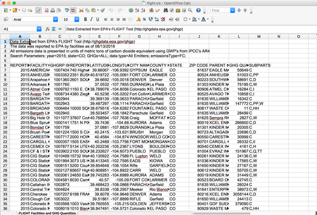
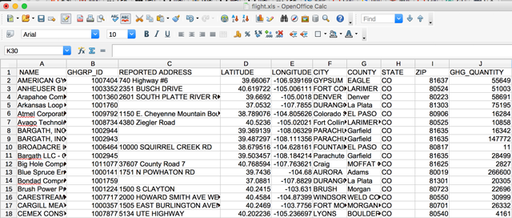
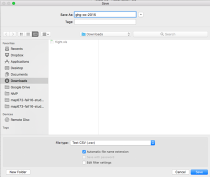
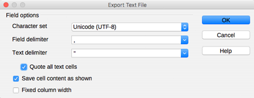
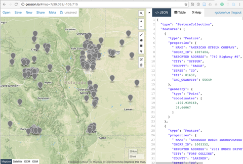
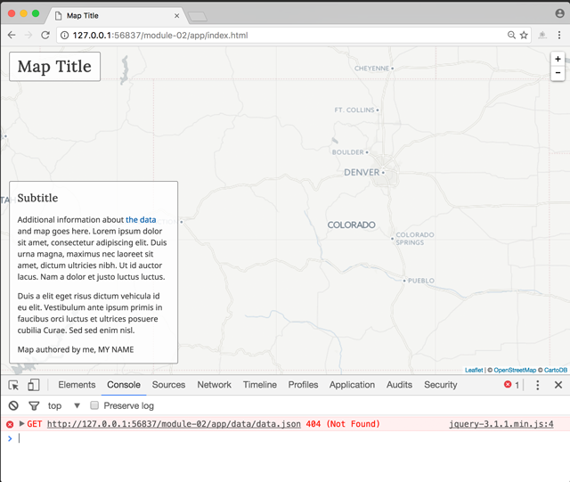
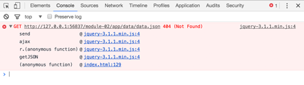

# Lesson 02. Thematic Web Mapping: Point Symbology

This lesson guides you through a process of creating a proportional symbol map.

Proportional symbol maps are a useful alternative to the common choropleth map. We can use them to map total or ratio data and unlike choropleth maps we don't need to standarize the data. We can use precise point data to make a proportional symbol map (such as the location of a coal plant), or conceptual point data (i.e., a wind farm covers a large area, but we can still represent it as a point). Proportional symbol maps are also good at showing relative magnitudes (i.e., "I can tell that this one is larger than that one"). We can make proportional symbol maps with any shape, though circles are the most common.

To begin, clone or [download the course repository](https://github.com/rgdonohue/web-mapping-short-course) to your computer.

Clone or unzip the contents of the files in a known location (i.e., a directory in your Documents). Examine the contents of the directory named *module-02/*. You notice a directory named *app/* that contains an HTML document named *index.html*.

Before proceeding, verify you have correctly set up your development environment with the ncessary components. Refer to [Lesson 01: Setting up a development environment](https://github.com/rgdonohue/web-mapping-short-course/blob/master/module-01/lesson-01.md#setting-up-a-development-environment) for help.


## Step 01: Data wrangling and conversion

First, let's get some data to play with. We're first going to download some tabular data from the web and manipulate it using a spreadsheet program. We'll then save it as a CSV file format before converting it to GeoJSON.

### Getting the data


Navigate to the EPA's [Facility Level Information on GreenHouse Gasses Tool (FLIGHT)](https://ghgdata.epa.gov/ghgp/main.do). The tool offers you several filtering options. 

  
**Figure XX.**

Narrow your search to a specific US state (e.g., Colorado) for 2015 data, and leave the rest of the options as default. When ready, click **Export Data** to download the data file. Note that it is downloaded as a Microsoft Xcel file named *flight.xls*. Save or move this file into the *data/* directory within the *module-02/app/* directory.

### Cleaning the data and converting to CSV

Next, open this file within a spreadsheet program. You can do this using Microsoft Xcel, but note the word of caution below regarding character encoding. We need to be very careful with these next steps. I'll be demonstrating this using OpenOffice.

Currently the data are encoded within the *.xls* file format (which OpenOffice and LibreOffice can read). Our next step is to clean this data up a bit and convert it to a CSV file. Because we're working with point-level data where each feature has a latitude and longitude value, the CSV will be the most efficient flat-file format in which to store the data.

  
**Figure XX.**

We first note that there are metadata stored within the first few rows of the file. You may want to copy this information and paste it into a *metadata.txt* file within your *data/* directory. Then delete the first 5 rows from the sheet.

Next, we can examine the data and remove any columns we don't need. Remember that when serving maps over the web we want to keep file sizes as small as we can. Even though broadband internet is fast, we're also designing our maps to work on mobile devices and a broader global audience with potentially limited bandwidth.

Remove the columns with headings "REPORTING YEAR", "PARENT COMPANIES", and "SUBPARTS".

Next, we want to further prepare the data for use within a scripting environment. **Spaces can be problematic in the names of files, directores, and data attributes. DON'T USE SPACES!!!** I had to yell that one because it is important and perpetually violated.

Let's run through the column headings (i.e., our data attributes) and edit them to remove spaces and make them more useful for our script later on.

Make the following changes:

* Change "FACILITY NAME" to "NAME"
* Change "GHGRP ID" to "GHGRP_ID" (note how I use an underscore here)
* Change "REPORTED ADDRESS" to "ADDRESS"
* Change "CITY NAME" to "CITY"
* Change "COUNTY NAME NAME" to "COUNTY"
* Change "ZIP CODE" to "ZIP"
* Change "GHG QUANTITY (METRIC TONS CO2e)" to "GHG_QUANTITY"

Save the changes to the *.xls* file.

  
**Figure XX.**

Next, we want to convert this file to a CSV format. While this should be a simple "Save As .." we need to be careful with this step. Different programs use different character encodings to save a CSV file, as well as different linebreak characters. This can cause problems later on when we load and parse the data using JavaScript in the browser.

When choosing **File -> Save As ...** in OpenOffice, I can choose the File type to be "Text CSV (.csv). I can also rename the file to something useful like *ghg-co-2015.csv*.

 
**Figure XX.**

Importantly, open office gives us an additional dialog box with **Export Text File** options. Ensure that the "Character set" is "Unicode (UTF-8)", the field delimiter is a comma, and that you've checked the box to "Quote all text cells"

  
**Figure XX.**

Click OK to export the CSV file, saving it again within the *module-02/app/data/* directory.

**Protip:** The open source text editor [Text Wrangler](http://www.barebones.com/products/TextWrangler/) is a great tool to have in your arsenal (NotePad++ is functionally equivilant for PCs). While note the developer's editor of choice, it handles large files well, is good for doing quick Find and Replace operations, and is helpful in ensuring your CSV file is saved with the correct character encoding, as well as how the line breaks are encoded (Legacy Mac OS (CR), Unix (LF), or Windows (CRLF)). LF or CR usually cause the least amount of problems.

### Converting the CSV data to GeoJSON

There are many ways to convert a CSV file to GeoJSON. One of the easiest, surprise surprise, is to use the web-based tool [geojson.io](http://geojson.io/).

Open the file in the web interface. Note that the attribute column headings and values within the CSV have been converted to key/value pairs within a `properties` object for each point feature in our data.

  
**Figure XX.**

Save this file to your local machine as a GeoJSON, and rename the file from *map.geojson* to *ghg-co-2015.json*.

Note how in this example, the original .xls file heading "Name" was edited to contain a space before the "N" ... " NAME". This is not a trivial error in coding and may cause problems later when trying to programmatically access the value of each feature's NAME attribute. Also, unlike the CSV in which that one heading entry can easily be edited, when we convert it to GeoJSON that mistake is replicated within the properties of each feature. However, a find and replace in a powerful text editor can quickly rectify the problem.


## Step 02: Loading data into the script

Begin by opening the *module-02/app/index.html* in your text editor and load the page in your browser using a local server (see [Lesson 01](https://github.com/rgdonohue/web-mapping-short-course/blob/master/module-01/lesson-01.md)).

We can see that a basic Leaflet map template has loaded within the page (using CARTO's light basemap tiles). With the developer tools open, we see there is also a 404 (Not Found) error generated within the script.

   
**Figure XX.**

Within the tool bar, we can drill down into what's known as the "call stack" or "stack trace" to further diagnose the error and where it occurs within our script. We see that within our *index.html* file it happens on line 129.

   
**Figure XX.**

The error is thrown within the JavaScript that is attempting to use an asynchronous request to load an external file.

```javascript
$.getJSON('data/data.json', function (data) {

    console.log(data);

});
```

The problem here is that JQuery's `.getJSON()` method is looking for a data file that doesn't exist. We don't currently have a file at this location: `'data/data.json'`.

Edit the JavaScript to look for our file named ghg-co-2015.json, save the changes and refresh the browser. Whalaa!! Provided there were no errors in the CSV encoding, or any additional errors in the JavaScript, you should see our point data drawn as the default Leaflet markers on the map.

   
**Figure XX.**


## Step 03: Drawing the point data as styled circles


## Step 04: Scaling the circles to a known quantity


## Step 05: Adding user interaction affordances and retrieving information


