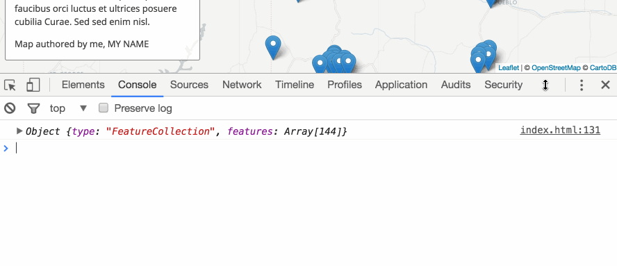
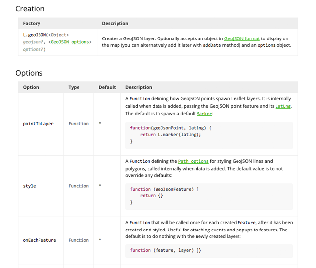
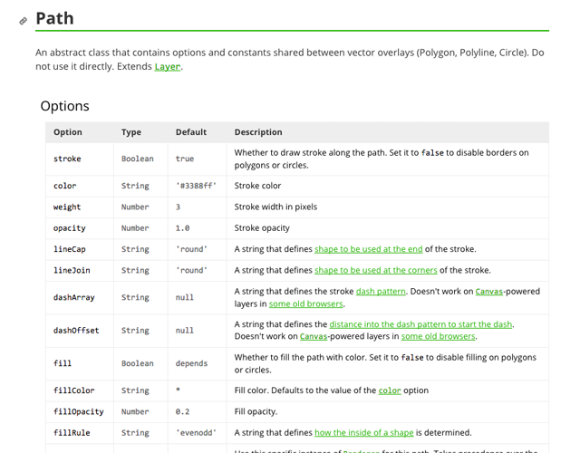
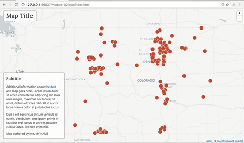
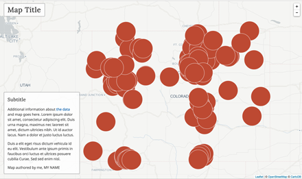
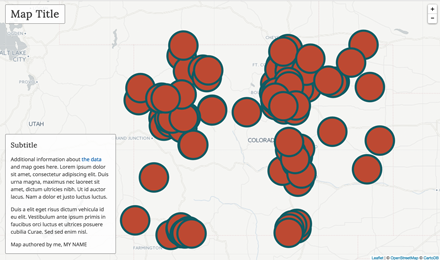
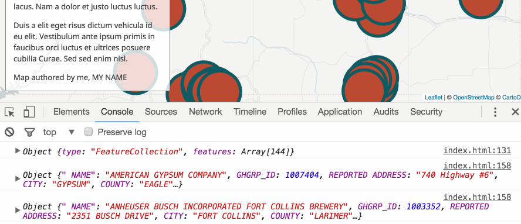
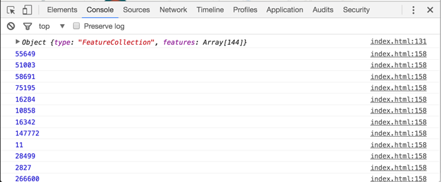
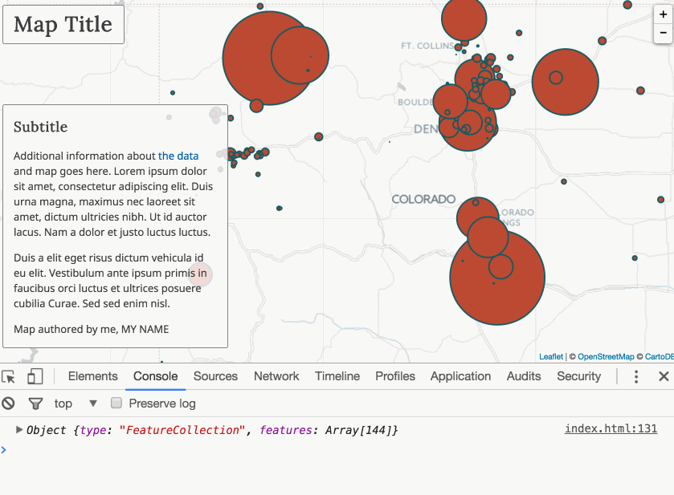
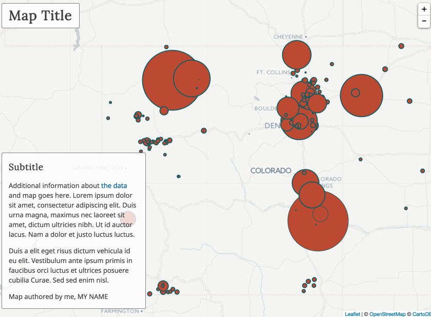

# Lesson 02. Thematic Web Mapping: Point Symbology

This lesson guides you through a process of creating a proportional symbol map.

Proportional symbol maps are a useful alternative to the common choropleth map. We can use them to map total or ratio data and unlike choropleth maps we don't need to standarize the data. We can use precise point data to make a proportional symbol map (such as the location of a coal plant), or conceptual point data (i.e., a wind farm covers a large area, but we can still represent it as a point). Proportional symbol maps are also good at showing relative magnitudes (i.e., "I can tell that this one is larger than that one"). We can make proportional symbol maps with any shape, though circles are the most common.

To begin, clone or [download the course repository](https://github.com/rgdonohue/web-mapping-short-course) to your computer.

Clone or unzip the contents of the files in a known location (i.e., a directory in your Documents). Examine the contents of the directory named *module-02/*. You notice a directory named *app/* that contains an HTML document named *index.html*.

Before proceeding, verify you have correctly set up your development environment with the ncessary components. Refer to [Lesson 01: Setting up a development environment](https://github.com/rgdonohue/web-mapping-short-course/blob/master/module-01/lesson-01.md#setting-up-a-development-environment) for help.


## Step 01: Data wrangling and conversion

First, let's get some data to play with. We're first going to download some tabular data from the web and manipulate it using a spreadsheet program. We'll then save it as a CSV file format before converting it to GeoJSON.

### Getting the data


Navigate to the EPA's [Facility Level Information on GreenHouse Gasses Tool (FLIGHT)](https://ghgdata.epa.gov/ghgp/main.do). The tool offers you several filtering options. 

  
**Figure XX.**

Narrow your search to a specific US state (e.g., Colorado) for 2015 data, and leave the rest of the options as default. When ready, click **Export Data** to download the data file. Note that it is downloaded as a Microsoft Xcel file named *flight.xls*. Save or move this file into the *data/* directory within the *module-02/app/* directory.

### Cleaning the data and converting to CSV

Next, open this file within a spreadsheet program. You can do this using Microsoft Xcel, but note the word of caution below regarding character encoding. We need to be very careful with these next steps. I'll be demonstrating this using OpenOffice.

Currently the data are encoded within the *.xls* file format (which OpenOffice and LibreOffice can read). Our next step is to clean this data up a bit and convert it to a CSV file. Because we're working with point-level data where each feature has a latitude and longitude value, the CSV will be the most efficient flat-file format in which to store the data.

  
**Figure XX.**

We first note that there are metadata stored within the first few rows of the file. You may want to copy this information and paste it into a *metadata.txt* file within your *data/* directory. Then delete the first 5 rows from the sheet.

Next, we can examine the data and remove any columns we don't need. Remember that when serving maps over the web we want to keep file sizes as small as we can. Even though broadband internet is fast, we're also designing our maps to work on mobile devices and a broader global audience with potentially limited bandwidth.

Remove the columns with headings "REPORTING YEAR", "PARENT COMPANIES", and "SUBPARTS".

Next, we want to further prepare the data for use within a scripting environment. **Spaces can be problematic in the names of files, directores, and data attributes. DON'T USE SPACES!!!** I had to yell that one because it is important and perpetually violated.

Let's run through the column headings (i.e., our data attributes) and edit them to remove spaces and make them more useful for our script later on.

Make the following changes:

* Change "FACILITY NAME" to "NAME"
* Change "GHGRP ID" to "GHGRP_ID" (note how I use an underscore here)
* Change "REPORTED ADDRESS" to "ADDRESS"
* Change "CITY NAME" to "CITY"
* Change "COUNTY NAME NAME" to "COUNTY"
* Change "ZIP CODE" to "ZIP"
* Change "GHG QUANTITY (METRIC TONS CO2e)" to "GHG_QUANTITY"

Save the changes to the *.xls* file.

  
**Figure XX.**

Next, we want to convert this file to a CSV format. While this should be a simple "Save As .." we need to be careful with this step. Different programs use different character encodings to save a CSV file, as well as different linebreak characters. This can cause problems later on when we load and parse the data using JavaScript in the browser.

When choosing **File -> Save As ...** in OpenOffice, I can choose the File type to be "Text CSV (.csv). I can also rename the file to something useful like *ghg-co-2015.csv*.

  
**Figure XX.**

Importantly, open office gives us an additional dialog box with **Export Text File** options. Ensure that the "Character set" is "Unicode (UTF-8)", the field delimiter is a comma, and that you've checked the box to "Quote all text cells."

  
**Figure XX.**

Click OK to export the CSV file, saving it again within the *module-02/app/data/* directory.

**Protip:** The open source text editor [Text Wrangler](http://www.barebones.com/products/TextWrangler/) is a great tool to have in your arsenal (NotePad++ is functionally equivilant for PCs). While note the developer's editor of choice, it handles large files well, is good for doing quick Find and Replace operations, and is helpful in ensuring your CSV file is saved with the correct character encoding, as well as how the line breaks are encoded (Legacy Mac OS (CR), Unix (LF), or Windows (CRLF)). LF or CR usually cause the least amount of problems.

### Converting the CSV data to GeoJSON

There are many ways to convert a CSV file to GeoJSON. One of the easiest, surprise surprise, is to use the web-based tool [geojson.io](http://geojson.io/).

Open the file in the web interface. Note that the attribute column headings and values within the CSV have been converted to key/value pairs within a `properties` object for each point feature in our data.

  
**Figure XX.**

Save this file to your local machine as a GeoJSON, and rename the file from *map.geojson* to *ghg-co-2015.json*.

Note how in this example, the original .xls file heading "Name" was edited to contain a space before the "N" ... " NAME". This is not a trivial error in coding and may cause problems later when trying to programmatically access the value of each feature's NAME attribute. Also, unlike the CSV in which that one heading entry can easily be edited, when we convert it to GeoJSON that mistake is replicated within the properties of each feature. However, a find and replace in a powerful text editor can quickly rectify the problem.


## Step 02: Loading data into the script

Begin by opening the *module-02/app/index.html* in your text editor and load the page in your browser using a local server (see [Lesson 01](https://github.com/rgdonohue/web-mapping-short-course/blob/master/module-01/lesson-01.md)).

We can see that a basic Leaflet map template has loaded within the page (using CARTO's light basemap tiles). With the developer tools open, we see there is also a 404 (Not Found) error generated within the script.

   
**Figure XX.**

Within the tool bar, we can drill down into what's known as the "call stack" or "stack trace" to further diagnose the error and where it occurs within our script. We see that within our *index.html* file it happens on line 129.

   
**Figure XX.**

The error is thrown within the JavaScript that is attempting to use an asynchronous request to load an external file.

```javascript
$.getJSON('data/data.json', function (data) {

    console.log(data);

});
```

The problem here is that JQuery's `.getJSON()` method is looking for a data file that doesn't exist. We don't currently have a file at this location: `'data/data.json'`.

Edit the JavaScript to look for our file named ghg-co-2015.json, save the changes and refresh the browser. Whalaa!! Provided there were no errors in the CSV encoding, or any additional errors in the JavaScript, you should see our point data drawn as the default Leaflet markers on the map.

   
**Figure XX.**

Note that we are logging to Console the variable `data`, which refers to our GeoJSON data we've loaded into the script. You can "drill down" to explore the structure of the data within the Console. It's the same structure that geojson.io helped us produce.

   
**Figure XX.**

The `index.html` starter file has quite a bit of JavaScript already written for us, with several key statements commented out. Let's take a moment to get the big picture of how this script is structured before exploring some of the details of how we turn these markers into propertional symbols.

You'll note that the script is broken down into many functions. Once our data is loaded, we call a function named `drawMap` and send our `data` variable as an argument. Within the `drawMap` function we currently use the Leaflet [L.GeoJson() method](http://leafletjs.com/reference-1.0.0.html#geojson) to convert this to a Leaflet object and add it to our map.

```javascript
function drawMap(data) {

    var options = {

        pointToLayer: pointToLayer,
        style: style,
        onEachFeature: onEachFeature

    }

    L.geoJson(data).addTo(map);

//  L.geoJson(data, options).addTo(map);

//  drawLegend(data)

}
```

Before we do anything else, note the `options` object within this function:

```javascript
var options = {

    pointToLayer: pointToLayer,
    style: style,
    onEachFeature: onEachFeature

}
```

These are options we can use when creating a Leaflet L.geoJson object, and the [API reference](http://leafletjs.com/reference-1.0.0.html#geojson) documents what they do and how to use them.

   
**Figure XX.**

The key on the left is associated with a function on the right of each, as as you scan the code below, you'll see that there are three respective functions for each of these options (here I've named the functions the same as the key, but these functions could be named anything).

When we pass this `options` object to the method that creates the Leaflet L.GeoJson() object, these functions will eventually do the following:

* The `pointToLayer` function will convert our point-level feature data to a Leaflet "layer" such as a vector layer. Specifically, we're going to convert them into [Leaflet's CircleMarker](http://leafletjs.com/reference-1.0.0.html#circlemarker) vector layer. Features become "layers" in Leaflet.
* The `style` function will return a style object used to change the visual appearance of the vector layers Leaflet draws to the map. All vector layers inherit the options available to the [L.Path class](http://leafletjs.com/reference-1.0.0.html#path) (see Figure XX below). You can edit, add, and remove these options.
* The `onEachFeature` function will iterate over all our features as they are converted to vector layers. This function allows us to do things like attache event handlers, such as a `'mouseover'` event to trigger a visual affordance or a tooltip.

   
**Figure XX.**

These functions are all called when the `options` object used when creating the Leaflet GeoJson layergroup (note in the API Reference that there are other methods to update the layers after creation.


## Step 03: Drawing the point data as styled circles

Within the `drawMap` function body, comment out the line that is drawing our data to the map as markers, and uncomment the line that is passing the `options` object to the L.geoJson() method.

```javascript
//  L.geoJson(data).addTo(map);

    L.geoJson(data, options).addTo(map);
```

Save these changes and refresh the browser. You'll now see our markers have been replaced by circleMarkers, styled with the options we're currently designating with the `style` function.

   
**Figure XX.**

Let's first fiddle with some of the code within two of the functions being called, the `pointToLayer` function and the `style` function.

Within the `pointToLayer` function we're returning a Leaflet circleMarker object, and passing one styling rule within this, setting the radius to 10 pixels.

Try changing this numeric value to something like 40. Saving and refreshing reveals how we can programmatically adjust the radius size of the circles.

```javascript
function pointToLayer(feature, latlng) {

//    console.log(feature.properties);

    return L.circleMarker(latlng, {

        radius: 40

    });

}
```

   
**Figure XX.**

Next, try adjusting some of the style options within the `style` function. For instance, we could make the stroke width larger (the `weight` property) and change its color value from `'whitesmoke'` to a hexidecimal value:


```javascript
function style(feature) {

    var styleOptions = {

        fillColor: '#bd4932',
        fillOpacity: 1,
        color: "#105b63",
        weight: 6

    }

    return styleOptions;

}

```

The result is again apparent in on the map.

   
**Figure XX.**

Now that we have a basic handle on that, let's return to the radius of our circles and figure out how to not size them uniformly, but given a quantitative value.


## Step 04: Scaling the circles to a known quantity

If we think back to our data, we remember that we encoded the amount of green house gases being emitted by different facilities with an attribute of `GHG_QUANTITY` (we can also peak in our GeoJSON data file for reference).

Within the `pointToLayer` function, first uncomment the line logging `feature.properties` to the Console.


```javascript
function pointToLayer(feature, latlng) {

    console.log(feature.properties);

    return L.circleMarker(latlng, {

        radius: 40

    });

}
```

Saving and refreshing in the browser allows you to see each feature's properties logged to the Console.

   
**Figure XX.**

This is a really important aspect of web map development. Within the script, we need to know how to access the data (in this case the `properties` of each GeoJSON point feature) associated or bound to features.

Modify the statement to include the `GHG_QUANTITY` property name: `console.log(feature.properties.GHG_QUANTITY);`.

We can now see how we can access the specific value we're interested in as the code loops through all the features in our data.

   
**Figure XX.**

Now we can simply replace the hard-coded value for our radius with the code accessing the value of each.

```javascript
function pointToLayer(feature, latlng) {


    return L.circleMarker(latlng, {

        radius: feature.properties.GHG_QUANTITY

    });

}
```

However, there are currently two problems with this. 1.) These numbers are quite large and our circles are drawn with diameters exceeding the extent of the map. 2.) We've used the data values to directly scale the symbol's radii. However, when making visual comparisons as it is currently coded, our eye-brain systems don't actually compare the radii, rather we compare the areas of these circles. Thus, a plant producing 20 times more emissions than another doesn't appear to have 20 times the area here, but an area much higher than that (20 squared times pi!).

To make the map work with human brains and eyes, we calculate radii to create these areas and use these to draw the circles.

To implement this in our code, instead of directly assigning a value to the radius of each CircleMarker, let's assign the return value of a function, which will scale and calculate the radius for us. This is as simple as calling a function and passing our data value to it: `radius: feature.properties.GHG_QUANTITY`. 

Below in the script we see I've already written a function to do the circle area calculation and scaling. This function accepts a value we send to it, does the calculation, and returns a value. Note that you may need to fiddle with the value of the `scaleFactor` a bit given a particular dataset.

```javascript
function calcRadius(val) {

    var radius = Math.sqrt(val / Math.PI),
        scaleFactor = .04;

    return radius * scaleFactor;

}
```

Once we made this modifications to our script, we should have a proportionally-scaled set of circles representing the relative magnitudes of gas emissions.


## Step 05: Adding user interaction affordances and retrieving information

Next, we want to add some interactivity for the user. To do so, we'll make use of the `onEachFeature` function, which like the others will iterate over all our data features when they are drawn to the map. We want to achieve two things: 1.) give the user a visual affordance that they've hovered over the symbol, and 2.) allow the user to retreive some specific info about the plant, displayed in a Leaflet tooltip.

Within the `onEachFeature` function, we're attaching what's known as an "event listener" to each layer. We're actually attaching two listeners, one for when the user mouses over a layer and another for when the user mouses off a layer. First, uncomment the statement within the function. Like the statement above, this will log to console the feature properties of the target layer when the user mouses over it.

```javascript
function onEachFeature(feature, layer) {

    layer.on({
        mouseover: function () {

            console.log(feature.properties);

        },
        mouseout: function () {


        }
    })  

}
```

We can inspect the output in the developer toolbar.

   
**Figure XX.**

Next modify the code within the `onEachFeature` function to change the stroke color of the target layer. Note that we have access to both the original GeoJSON feature data here, as well as the vector layer being created. We want to modify the style rules of the vector layer.

```javascript
layer.on({
    mouseover: function () {

        layer.setStyle({
            color: "yellow",
            weight: 3
        });

    },
    mouseout: function () {

        layer.setStyle({
            color: "#105b63",
            weight: 1
        });
    }
});
```

This code is using a Leaflet `setStyle` method to change the values of two style properties, the stroke color and width. On the mouseout event, we want to set them back to their original look.

   
**Figure XX.**

Finally, we want the user to retrive some specific information about each feature on mouseover. While we could build a more sophisticated info window or display this information in a side panel, for now a simple tooltip will work for us.

Add the following code to the `onEachFeature` function:

```javascript
function onEachFeature(feature, layer) {

    layer.on({
        mouseover: function () {

            layer.setStyle({
                color: "yellow",
                weight: 3
            });

        },
        mouseout: function () {

            layer.setStyle({
                color: "#105b63",
                weight: 1
            });
        }
    });


    var toolTipInfo = "Name: " + feature.properties.NAME + "<br>" +
        "C02: " + feature.properties.GHG_QUANTITY.toLocaleString() + "metric tons"


    layer.bindTooltip(toolTipInfo, { sticky: true });

}
```

Note that we're again accessing specific information from each feature using the `feature.properties` syntax. We're also using a convienent JavaScript method `toLocaleString()` to format the number nicely with commas.


